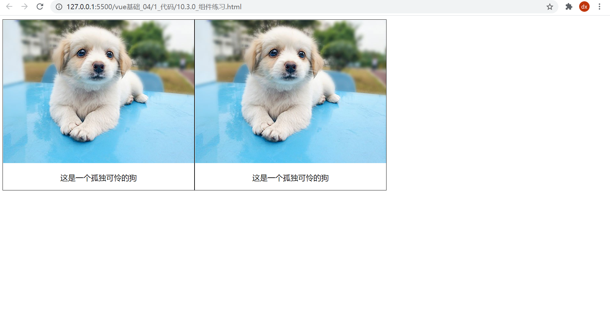
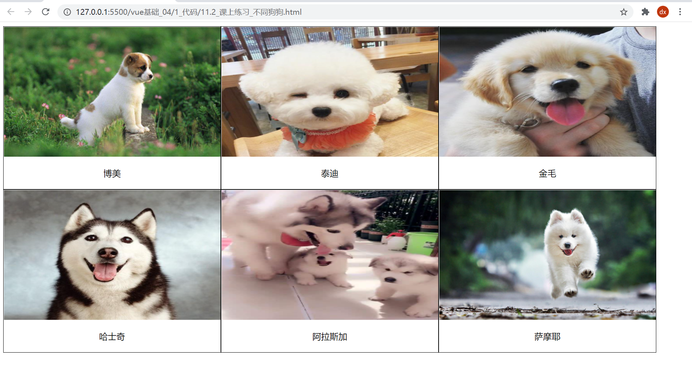
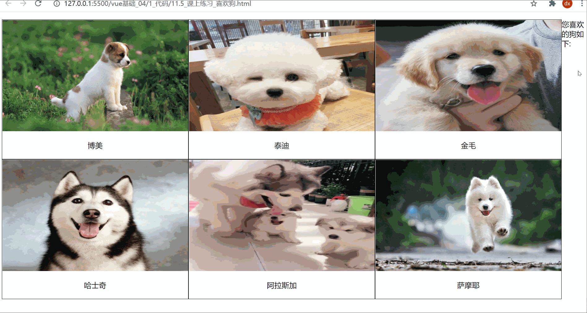

# vue第四天作业

## 1.喜欢小狗狗吗

> 目标: 封装Dog组件, 用来复用显示图片和标题的

效果:



----

正确答案(==先不要看==)

components/practise/Dog1.vue

```html
<template>
  <div class="my_div">
    
    <p>这是一个孤独可怜的狗</p>
  </div>
</template>

<script>
export default {};
</script>

<style>
.my_div {
  width: 200px;
  border: 1px solid black;
  text-align: center;
  float: left;
}

.my_div img {
  width: 100%;
  height: 200px;
}
</style>
```

在App.vue中使用

```vue
<template>
  <div>
    <Dog></Dog>
    <Dog/>
  </div>
</template>

<script>
import Dog from '@/components/practise/Dog1'
export default {
  components: {
    Dog
  }
}
</script>

<style>

</style>
```

> 总结: 重复部分封装成组件, 然后注册使用

## 2. 卖狗啦

> 目标: 把数据循环用组件显示铺设

数据:

```js
[
    {
        dogImgUrl: "自己找下网上图片链接",
        dogName: "博美",
    },
    {
        dogImgUrl:"自己找下网上图片链接",
        dogName: "泰迪",
    },
    {
        dogImgUrl:"自己找下网上图片链接",
        dogName: "金毛",
    },
    {
        dogImgUrl:"自己找下网上图片链接",
        dogName: "哈士奇",
    },
    {
        dogImgUrl:"自己找下网上图片链接",
        dogName: "阿拉斯加",
    },
    {
        dogImgUrl:"自己找下网上图片链接",
        dogName: "萨摩耶",
    },
]
```

图示:



正确代码(==不可复制==)

components/practise/Dog3.vue

```vue
<template>
  <div class="my_div">
    
    <p :style="{ backgroundColor: colorStr }" @click="btn">{{ dogname }}</p>
  </div>
</template>

<script>
export default {
  props: ["imgurl", "dogname"],
  data() {
    return {
      colorStr: "",
    };
  },
  methods: {
    btn() {
      this.colorStr = `rgb(${Math.floor(Math.random() * 256)}, ${Math.floor(
        Math.random() * 256
      )}, ${Math.floor(Math.random() * 256)})`;

      
    },
  },
};
</script>

<style scoped>
.my_div {
  width: 200px;
  border: 1px solid black;
  text-align: center;
  float: left;
}

.my_div img {
  width: 100%;
  height: 200px;
}
</style>
```

App.vue引入使用把数据循环传给组件显示

```vue
<template>
  <div>
    <Dog v-for="(obj, index) in arr"
    :key="index"
    :imgurl="obj.dogImgUrl"
    :dogname="obj.dogName"
    ></Dog>
  </div>
</template>

<script>
import Dog from '@/components/practise/Dog3'
export default {
  data() {
    return {
      // 1. 准备数据
      arr: [
        {
          dogImgUrl:"自己找下网上图片链接",
          dogName: "博美",
        },
        {
          dogImgUrl:"自己找下网上图片链接",
          dogName: "泰迪",
        },
        {
          dogImgUrl:"自己找下网上图片链接",
          dogName: "金毛",
        },
        {
          dogImgUrl:"自己找下网上图片链接",
          dogName: "哈士奇",
        },
        {
          dogImgUrl:"自己找下网上图片链接",
          dogName: "阿拉斯加",
        },
        {
          dogImgUrl:"自己找下网上图片链接",
          dogName: "萨摩耶",
        },
      ],
    };
  },
  components: {
    Dog
  }
};
</script>
```

## 3.选择喜欢的狗

> 目标: 用户点击狗狗的名字, 在右侧列表显示一次名字

效果:



正确代码(==不可复制==)

components/practise/Dog4.vue

```vue
<template>
  <div class="my_div">
    
    <p :style="{ backgroundColor: colorStr }" @click="btn">{{ dogname }}</p>
  </div>
</template>

<script>
export default {
  props: ["imgurl", "dogname"],
  data() {
    return {
      colorStr: "",
    };
  },
  methods: {
    btn() {
      this.colorStr = `rgb(${Math.floor(Math.random() * 256)}, ${Math.floor(
        Math.random() * 256
      )}, ${Math.floor(Math.random() * 256)})`;

      // 补充: 触发父级事件
      this.$emit("love", this.dogname);
    },
  },
};
</script>

<style scoped>
.my_div {
  width: 200px;
  border: 1px solid black;
  text-align: center;
  float: left;
}

.my_div img {
  width: 100%;
  height: 200px;
}
</style>
```

App.vue

```vue
<template>
  <div>
    <Dog
      v-for="(obj, index) in arr"
      :key="index"
      :imgurl="obj.dogImgUrl"
      :dogname="obj.dogName"
      @love="fn"
    ></Dog>

    <hr />
    <p>显示喜欢的狗:</p>
    <ul>
      <li v-for="(item, index) in loveArr" :key="index">{{ item }}</li>
    </ul>
  </div>
</template>

<script>
import Dog from "@/components/practise/Dog4";
export default {
  data() {
    return {
      // 1. 准备数据
      arr: [
        {
          dogImgUrl:"自己找下网上图片链接",
          dogName: "博美",
        },
        {
          dogImgUrl:"自己找下网上图片链接",
          dogName: "泰迪",
        },
        {
          dogImgUrl:"自己找下网上图片链接",
          dogName: "金毛",
        },
        {
          dogImgUrl:"自己找下网上图片链接",
          dogName: "哈士奇",
        },
        {
          dogImgUrl:"自己找下网上图片链接",
          dogName: "阿拉斯加",
        },
        {
          dogImgUrl:"自己找下网上图片链接",
          dogName: "萨摩耶",
        },
      ],
      loveArr: []
    };
  },
  components: {
    Dog,
  },
  methods: {
    fn(dogName) {
      this.loveArr.push(dogName)
    },
  },
};
</script>

<style >
</style>
```


## 4. 购物车

目的: 把一行tr封装成一个组件, 然后v-for循环复用传值

将合计行单独封装成组件

> 提示: 对象类型传入到子组件, 内部修改也会相应外部这个对象 (对象是引用关系哦)


不带vue代码的标签结构(==可以复制==)接着写

```vue
<template>
  <div>
    <table
      border="1"
      width="700"
      style="border-collapse: collapse"
    >
      <caption>
        购物车
      </caption>
      <thead>
        <tr>
          <th>
            <input type="checkbox" /> <span>全选</span>
          </th>
          <th>名称</th>
          <th>价格</th>
          <th>数量</th>
          <th>总价</th>
          <th>操作</th>
        </tr>
      </thead>
      <tbody>
        
      </tbody>
      <tfoot>
        <tr>
          <td>合计:</td>
          <td colspan="5">
            
          </td>
        </tr>
      </tfoot>
    </table>
  </div>
</template>

<script>
export default {
  data() {
    return {
      goodList: [
        {
          name: "诸葛亮",
          price: 1000,
          num: 1,
          checked: false,
        },
        {
          name: "蔡文姬",
          price: 1500,
          num: 1,
          checked: false,
        },
        {
          name: "妲己",
          price: 2000,
          num: 1,
          checked: false,
        },
        {
          name: "鲁班",
          price: 2200,
          num: 1,
          checked: false,
        },
      ],
    };
  },
};
</script>

<style>
</style>
```
